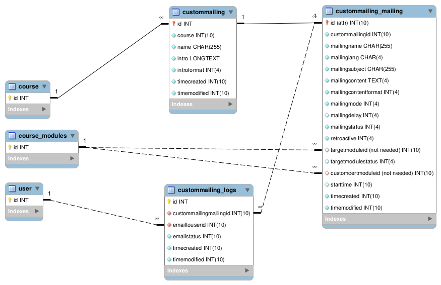

# Custom mailing activity

This activity allows custom mailing creation with following parameters :

Send an email to each user enrolled in the course :

* at course enrol
* x days(s) after first access of the course
* x days(s) after last access of the course
* x days(s) after first launch of a scorm (optional scorm completion status)
* x days(s) after last launch of a scorm (optional scorm completion status)

* Retroactive mode available for each mailing
  
This plugin can also generate and send a PDF certificate linked to the mailing when conditions are met.
This feature requires Mod customcert plugin https://moodle.org/plugins/mod_customcert

You can create more than one mailing by activity but each user can only receive one email per mailing.

## Diagram


## Installation

There are two installation methods available. 

Follow one of these, then log into your Moodle site as an administrator and visit the notifications page to complete the install.

### Git

This requires Git being installed. If you do not have Git installed, please visit the [Git website](https://git-scm.com/downloads "Git website").

Once you have Git installed, simply visit your Moodle mod directory and clone the repository using the following command.

```
git clone https://github.com/cbluesprl/moodle-mod_custommailing.git custommailing
```

Or add it with submodule command if you use submodules.

```
git submodule add https://github.com/cbluesprl/moodle-mod_custommailing.git mod/custommailing
```

### Download the zip

Visit the [Moodle plugins website](https://moodle.org/plugins/mod_custommailing "Moodle plugins website") and download the zip corresponding to the version of Moodle you are using. Extract the zip and place the 'custommailing' folder in the mod folder in your Moodle directory.

## License

Licensed under the [GNU GPL License](http://www.gnu.org/copyleft/gpl.html).

## Data Privacy

Despite the fact that the plugin can send emails, user email addresses are not stored by the plugin.
When a user is deleted by Moodle then user data in this plugin will be deleted.

## Test

* Log in as admin
* Create a course
* Enable course completion
* Add an activity of type 'scorm' with completion on 'Student must view this activity to complete it'
* Add an activity of type 'custommailing'
* Enrol 1 user with the teacher role to the course
* Enrol 2 users with the student role to the course
* In administration > Plugins > Activity Modules > Custom mailing : Enable debug mode (so you won't have to wait an hour)
* Log in as teacher
* In the Custommailing activity, create a mailing. Parameter it.
  * Send the mail 1 day after first launch
    * This will be displayed as 1 day but will in fact be 1 minute if the debug mode is activated for the plugin (see previous steps)
  * and target module is not completed by the user (yes)
* Log in as first student and complete the scorm
* Launch the cron task manually (\mod_custommailing\task\cron_task)
* Check the table mal_custommailing_logs : only the second student has been targeted
* Check disabling a mailing in interface by consulting the custommailing activity as teacher or admin
* Check deletion a mailing in interface by consulting the custommailing activity as teacher or admin

